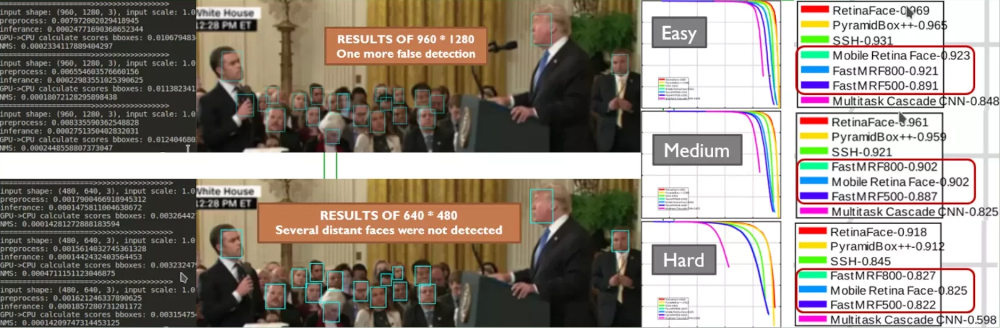

# Face Detection @ 500-1000 FPS



[](https://lgtm.com/projects/g/1996scarlet/faster-mobile-retinaface/context:python)
[](LICENSE.md)
[](https://openaccess.thecvf.com/content_CVPR_2020/html/Deng_RetinaFace_Single-Shot_Multi-Level_Face_Localisation_in_the_Wild_CVPR_2020_paper.html)

100% Python3 reimplementation of [RetinaFace](https://github.com/deepinsight/insightface/tree/master/RetinaFace), a solid single-shot face localisation framework in [CVPR 2020](https://openaccess.thecvf.com/content_CVPR_2020/html/Deng_RetinaFace_Single-Shot_Multi-Level_Face_Localisation_in_the_Wild_CVPR_2020_paper.html).

* Replaced CUDA based anchor generator functions with NumPy APIs.
* Stored runtime anchors via dict to avoid duplicate counting.
* Optimized NMS algorithm through vector calculation methods.
* Reduced FPN layers and anchor density for middle-close range detection.
* Used low-level Mxnet APIs to speed up the inference process.

## Getting Start

### Requirements

* [Install GStreamer](https://gstreamer.freedesktop.org/documentation/installing/on-linux.html?gi-language=c) for reading videos (Optional)
* Mxnet >= 1.5.0 (preferably CUDA based package)
* Python >= 3.6
* opencv-python

While not required, for optimal performance, it is highly recommended to run the code using a CUDA enabled GPU.

### Running for Video Files

``` bash
gst-launch-1.0 -q filesrc location=$YOUR_FILE_PATH !\
  qtdemux ! h264parse ! avdec_h264 !\
  video/x-raw, width=640, height=480 ! videoconvert !\
  video/x-raw, format=BGR ! fdsink | python3 face_detector.py
```

### Real-Time Capturing via Webcam

``` bash
gst-launch-1.0 -q v4l2src device=/dev/video0 !\
  video/x-raw, width=640, height=480 ! videoconvert !\
  video/x-raw, format=BGR ! fdsink | python3 face_detector.py
```

### Some Tips

* Be Careful About `!` and `|`
* Decoding the H.264 (or other format) stream using **CPU** can cost much. I'd suggest using your **NVIDIA GPU** for decoding acceleration. See [Issues#5](https://github.com/1996scarlet/faster-mobile-retinaface/issues/5) and [nvbugs](https://forums.developer.nvidia.com/t/gstreamer-lockup-with-h-264-encoder-from-nvarguscamerasrc/154942) for more details.
* For Jetson-Nano, following [Install MXNet on a Jetson](https://mxnet.apache.org/get_started/jetson_setup) to prepare your envoriment.

## Methods and Experiments

For middle-close range face detection, appropriately removing FPN layers and reducing the density of anchors could count-down the overall computational complexity. In addition, low-level APIs are used at preprocessing stage to bypass unnecessary format checks. While inferencing, runtime anchors are cached to avoid repeat calculations. More over, considerable speeding up can be obtained through vector acceleration and NMS algorithm improvement at post-processing stage.

Experiments have been carried out via GTX 1660Ti with CUDA 10.2 on KDE-Ubuntu 19.10.

Scale | RetinaFace | Faster RetinaFace | Speed Up
--------|-----|--------|---------
0.1 | 2.854ms | 2.155ms | 32%
0.4 | 3.481ms | 2.916ms | 19%
1.0 | 5.743ms | 5.413ms | 6.1%
2.0 | 22.351ms | 20.599ms | 8.5%

Results of several scale factors at VGA resolution show that our method can speed up by 32%.
As real resolution increases, the proportion of feature extraction time spent in the measurement process will increase significantly, which causes our acceleration effect to be diluted.

Plantform | Inference | Postprocess | Throughput Capacity
--------|-----|--------|---------
9750HQ+1660TI | 0.9ms | 1.5ms | 500~1000fps
Jetson-Nano | 4.6ms | 11.4ms | 80~200fps

Theoretically speaking, throughput capacity can reach the highest while the queue is bigger enough.

## Citation

``` bibtex
@inproceedings{deng2019retinaface,
    title={RetinaFace: Single-stage Dense Face Localisation in the Wild},
    author={Deng, Jiankang and Guo, Jia and Yuxiang, Zhou and Jinke Yu and Irene Kotsia and Zafeiriou, Stefanos},
    booktitle={arxiv},
    year={2019}
}
```
